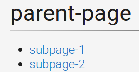

# Grav Subpages Plugin

[](https://packagist.org/packages/acalcutt/grav-plugin-subpages)

This Grav plugin displays a list of direct, visible sub-pages for the current page. It's designed to be a simple and straightforward way to provide navigation to child pages.

## Features

*   **Direct Subpages:** Displays only the immediate children of the current page.
*   **Visibility Check:** Only shows pages that are explicitly visible (not hidden).
*   **Routable Check:** Only shows pages that are routable.
*   **Configurable List Style:** Allows you to choose between `ul` (unordered list) and `ol` (ordered list) in the plugin's configuration.
*   **Easy Integration:** Uses a simple Twig include to display the list on your pages.
*   **"Back to Parent" Link:** Adds a navigation link to the parent page (if not a root page), using `[..]` notation, for a concise and clean way to go back one level.

## How It Works

The plugin works by:

1.  **Hooking into the Grav Events:** The plugin listens for Grav's `onPluginsInitialized` and `onTwigSiteVariables` events. It also uses `onTwigTemplatePaths` for loading template paths.
2.  **Adding Template Path:** When the `onPluginsInitialized` event fires, the plugin adds its `/templates` directory to Grav's Twig template paths so it can find the correct template file.
3.  **Fetching Subpages:** When `onTwigSiteVariables` fires, the plugin retrieves the current page object, then it uses the function `getVisibleSubpages` to get the subpages that are both visible and routable.
4.  **Fetching Parent:** When `onTwigSiteVariables` fires, the plugin retrieves the current page object, then it uses the function `getParentPage` to get the current page's parent (or null if it doesn't have one).
5.  **Passing Data to Twig:** The plugin makes this data available to your Twig templates through the `subpages`, `parent` and `subpages_config` variables.
6.  **Rendering the Subpage List:** In your Twig template, you include `subpages.html.twig`, which loops through the `subpages` variable and renders the list of links. The style of list will depend on the `subpages_config.style`.

## Installation

### With Grav Package Manager (GPM)

1.  Navigate to the `/admin/plugins` page in your browser.
2.  Search for "Subpages" and click the install button.

### Manually

1.  **Download:** Download the plugin from the [GitHub Releases](https://github.com/acalcutt/grav-plugin-subpages/releases) page or clone this repository to the `user/plugins/subpages` directory of your Grav site:
    ```bash
    cd user/plugins
    git clone https://github.com/acalcutt/grav-plugin-subpages subpages
    ```
2.  **Enable the Plugin:**
    *   Log in to your Grav Admin panel.
    *   Navigate to "Plugins."
    *   Find the "Subpages" plugin and enable it by toggling the switch.
    *   Configure the list `style`. You can choose between `ul` for an unordered list or `ol` for an ordered list.
3.  **Clear the Cache:** Clear the Grav cache, just in case.

## Usage

1.  **Add the Twig Include:** In the Twig template where you want to display the subpage list, add the following include:

    ```twig
    
       
     
    ```

    *   This could be in your theme's `base.html.twig` file (or `default.html.twig` if you don't have a `base.html.twig`), or in a specific page's Twig template.
    *   **Important:** The plugin adds the `subpages`, `parent`, and `subpages_config` variables to your Twig environment so that the `subpages.html.twig` template can access it.

## Example

Let's say you have a page structure like this:

```
/01.parent-page/
  /01.subpage-1/
  /02.subpage-2/
  /03.subpage-3/  (hidden)
```

If you navigate to `/01.parent-page/` and have the plugin enabled with a unordered list style, the output will be something like this:


If you are using the ordered list style, the output will look like this:


*   Note that `subpage-3` is not listed as it is hidden (not visible)

## Configuration

The plugin has the following configuration options under the "Subpages" section in the Grav admin panel:

*   **Plugin Status (enabled):** Enable or disable the plugin.
*   **Style:** Allows you to chose between `ul` for an unordered list or `ol` for an ordered list.
*   **Show Previous Page Link (enabled):** Enable or disable the [..] Previous Page Link at the top of the list. Disabling this option makes the munu look like this.  
      
      

## Customization

*   **CSS:** Customize the appearance of the list by adding styles to the `.subpages-list` class in your theme's CSS file.
*   **Template:** You can modify the `subpages.html.twig` template to change the HTML structure of the list to fit your needs.

## Admin Preview Limitation

*   The subpages list may not be fully visible in the admin preview. This is expected behavior, as the admin preview is not designed to render all aspects of plugins or themes. It is meant for previewing content, not elements. The most important testing should always be done on the front-end of the website.

## License

This plugin is released under the [MIT License](LICENSE).
